<div align="center">

<!-- Hero Terminal SVG — file lives in the same repo -->


<br/>

<!-- Auto-updated action status badges -->
[](https://github.com/Sysitn/Sysitn/actions/workflows/snake.yml)&nbsp;
[](https://github.com/Sysitn/Sysitn/actions/workflows/metrics.yml)&nbsp;
[](https://github.com/Sysitn/Sysitn/actions/workflows/profile-cards.yml)

</div>

---

```fish
sysitn@github ~/profile ❯ ls --color ./stats
```

<div align="center">
<br/>


&nbsp;&nbsp;


<br/><br/>


</div>

---

```fish
sysitn@github ~/profile ❯ cat ./activity.log
```

<div align="center">
<br/>

[](https://github.com/ashutosh00710/github-readme-activity-graph)

</div>

---

```fish
sysitn@github ~/profile ❯ watch -n 21600 ./snake --eat-contributions  # обновляется каждые 6ч
```

<div align="center">
<br/>

<picture>
  <source media="(prefers-color-scheme: dark)"  srcset="https://raw.githubusercontent.com/Sysitn/Sysitn/output/snake-dark.svg"/>
  <source media="(prefers-color-scheme: light)" srcset="https://raw.githubusercontent.com/Sysitn/Sysitn/output/snake-light.svg"/>
  
</picture>

</div>

---

```fish
sysitn@github ~/profile ❯ ./metrics --render --all-plugins
```

<div align="center">
<br/>


</div>

---

```fish
sysitn@github ~/profile ❯ ./profile-cards --theme dracula
```

<div align="center">
<br/>


<br/>

&nbsp;


<br/>

&nbsp;


</div>

---

```fish
sysitn@github ~/profile ❯ cat ./trophies.txt
```

<div align="center">
<br/>

[](https://github.com/ryo-ma/github-profile-trophy)

</div>

---

```fish
sysitn@github ~/profile ❯ cat src/me.rs
```

```rust
#[derive(Debug, Clone)]
struct Sysitn {
    name:      &'static str,
    focus:     Vec<&'static str>,
    languages: Vec<&'static str>,
    os:        &'static str,
    currently: &'static str,
    coffee:    f64,
}

impl Sysitn {
    fn new() -> Self {
        Self {
            name:      "sysitn",
            focus:     vec!["systems", "kernel", "low-level", "performance"],
            languages: vec!["C", "C++", "Rust", "Python", "Bash"],
            os:        "CachyOS Linux 🐧",
            currently: "writing code that talks directly to the metal ⚡",
            coffee:    f64::INFINITY,
        }
    }
}

fn main() {
    let me = Sysitn::new();
    println!("Hello, world. I am {:?}", me.name);
    // output: Hello, world. I am "sysitn"
}
```

---

```fish
sysitn@github ~/profile ❯ echo "see you around" && exit
```

<div align="center">
<br/>

[](https://github.com/Sysitn)&nbsp;
[](https://github.com/Sysitn)

<br/><br/>

```
Connection closed. ⚡
```

</div>
